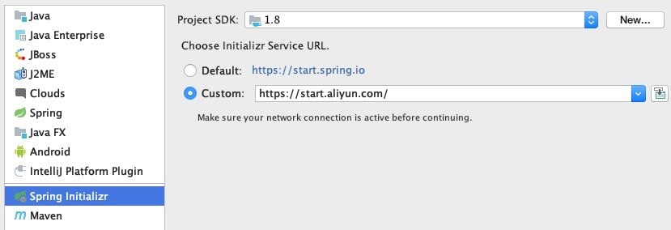
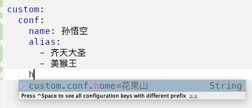

# Spring Boot 学习笔记

[toc]

## start

创建一个 Spring Boot 项目



可以使用默认从 [https://start.spring.io](https://start.spring.io) 生成
也可以使用阿里提供的 [https://start.aliyun.com](https://start.aliyun.com) 生成

启动一个SpringBoot项目

```java
// @ComponentScan
// @Configuration
// @EnableAutoConfiguration
@SpringBootApplication
public class WebApplication {
    public static void main(String[] args) {
        SpringApplication.run(WebApplication.class, args);
    }
}
```

> @SpringBootApplication 相当于 @EnableAutoConfiguration 、@ComponentScan 、@Configuration 三个注解。
> 需要注意的是在未使用@SpringBootApplication注解时需要在测试的@SpringBootTest注解声明启动类

SpringBoot应用启动后启动特定的功能代码，CommandLineRunner 或 ApplicationRunner

```java
@Component
public class MyBean implements CommandLineRunner {
    public void run(String... args) {
        // code
    }
}
```

> CommandLineRunner 接口使用简单字符串获得对应程序参数  
> ApplicationRunner 则通过 ApplicationArguments 获得

## conf

Spring Boot 配置的部分说明

> Spring Boot 支持 bootstrap， 支持 banner

### 配置文件

SpringBoot使用一个全局的配置文件，配置文件名是固定的；

+ application.properties

+ application.yml

配置文件的作用：修改SpringBoot自动配置的默认值；SpringBoot在底层都给我们自动配置好；

#### YAML（YAML Ain't Markup Language）

A Markup Language：是一个标记语言
isn't Markup Language：不是一个标记语言；

​**以数据为中心**，比json、xml等更适合做配置文件；

```yaml
server:
  port: 8081
```

##### YAML语法

###### 基本语法

k:(空格)v  =>  表示一对键值对（空格必须有）；
以**空格**的缩进来控制层级关系；只要是左对齐的一列数据，都是同一个层级的

```yaml
server:
    port: 8081
    path: /hello
```

> 属性和值也是大小写敏感

###### 值的表示

+ 字面量
k: v：字面直接来写；
​字符串默认不用加上单引号或者双引号；
​""：双引号；会转义字符串里面的特殊字符；特殊字符会作为本身想表示的意思
​''：单引号；不会转义特殊字符，特殊字符最终只是一个普通的字符串数据

```yml
    name: "孙悟空\n美猴王" # 孙悟空\n美猴王
    home: '花果山\n水帘洞' # 孙悟空\\n美猴王
```

+ 对象、Map
​k: v：在下一行来写对象的属性和值的关系；注意缩进

```yaml
# 缩进写法
monkey:
    name: 孙悟空
    home: 花果山

# 行内写法
pig: {name: 猪八戒, home: 高老庄}
```

+ 数组
用  -  表示数组中的一个元素

```yaml
# 缩进写法
monkey:
    name: 孙悟空
    alias:
        - 美猴王
        - 齐天大圣

# 行内写法
pig: {name: 猪八戒, alias: [天蓬元帅,净坛使者]}
```

### 配置文件注入

常用 @Value 和 @ConfigurationProperties 两个注解获取配置值

#### @Value

在SpringBean中使用时生效

```java
@Value("${pig.name}")
private String name;
```

> 支持：字面量/${key}从环境变量、配置文件中获取值/#{SpEL}

#### @ConfigurationProperties

定义一个bean, 并将配置文件中配置的每一个属性的值，映射到这个组件中

```java
/**
 * @ConfigurationProperties：告诉SpringBoot将本类中的所有属性和配置文件中相关的配置进行绑定；
 *      prefix = "custom.conf"：配置文件中 custom.conf 下面的所有属性进行一一映射
 */
@Component
@ConfigurationProperties(prefix = "custom.conf")
public class CustomConf {

    private String name;

    private String[] alias;

    // 设置缺省值
    private String home = "花果山";
}
```

若想实现配置提示效果

则还需倒入以下依赖生成元数据

```xml
<dependency>
    <groupId>org.springframework.boot</groupId>
    <artifactId>spring-boot-configuration-processor</artifactId>
    <optional>true</optional>
</dependency>
```

#### 比较

配置文件yml还是properties他们都能获取到值；
||@ConfigurationProperties|@Value|
|:-|:-:|:-:|
|绑定注入|批量注入配置文件中的属性|一个个指定|
|松散绑定（松散语法）|支持|不支持|
|SpEL|不支持|支持|
|JSR303数据校验|支持|不支持|
|复杂类型封装|支持|不支持|

### Profile

Spring Boot 支持多profile文件，文件名可以是 application-{profile}.properties/yml
profile 可以使用多文件方式也可以使用文档块方式

```yml
spring:
  profiles:
    active: prod

---
server:
  port: 8081
spring:
  profiles: dev

---
server:
  port: 8088
spring:
  profiles: prod  #指定属于哪个环境
```

激活指定的 profile:

1. 配置文件中： spring.profiles.active 配置
1. 命令行： java -jar --spring.profiles.active=xx xxxxx
1. 虚拟机参数：-Dspring.profiles.active=xx

### 配置文件加载位置

#### 内部

springboot 启动会扫描以下位置的application.properties或者application.yml文件作为Spring boot的默认配置文件:

1. file:./config/
1. file:./
1. classpath:/config/
1. classpath:/

==优先级由高到底，高优先级的配置会覆盖低优先级的配置==
SpringBoot会从这四个位置全部加载主配置文件:**互补配置**
==还可以通过spring.config.location来改变默认的配置文件位置==

#### 外部

1. **命令行参数**
1. 来自java:comp/env的JNDI属性
1. Java系统属性（System.getProperties()）
1. 操作系统环境变量
1. RandomValuePropertySource配置的random.*属性值
1. **jar包外部的application-{profile}.properties或application.yml(带spring.profile)配置文件**
1. **jar包内部的application-{profile}.properties或application.yml(带spring.profile)配置文件**
1. **jar包外部的application.properties或application.yml(不带spring.profile)配置文件**
1. **jar包内部的application.properties或application.yml(不带spring.profile)配置文件**
1. @Configuration注解类上的@PropertySource
1. 通过SpringApplication.setDefaultProperties指定的默认属性

==优先级从高到低；高优先级的配置覆盖低优先级的配置，所有的配置会形成互补配置==
优先加载带profile,再来加载不带profile

> [参考文档](https://docs.spring.io/spring-boot/docs/2.2.6.RELEASE/reference/htmlsingle/#boot-features-external-config)

## log

### 简要配置

```yml
logging:
  pattern:
    # 控制台输出格式
    console: '%d{yyyy/MM/dd HH:mm:ss}[%yellow(%thread)-%clr(%5p)]%green(%logger):%msg%n'
    # 文件输出格式
    file: '%d{yyyy/MM/dd HH:mm:ss} [%thread-%5p] %-3L @ %logger: %msg%n'
  # 日志级别
  level:
    # root 表示指定全部，可分包指定
    root: info
  file:
    # 指定日志文件
    name: logs/runtime.log
```

`logging.file.name` 与 `logging.file.path` 同时存在时 `logging.file.name` 生效

|`logging.file.name`|`logging.file.path`|Description|
|:-:|:-:|:-:|
|(none)|(none)|只在控制台输出|
|指定文件名|(none)|输出日志到my.log文件|
|(none)|指定目录|输出到指定目录的 spring.log 文件中|

> 其他设置:[参考文档](https://docs.spring.io/spring-boot/docs/2.2.6.RELEASE/reference/htmlsingle/#boot-features-logging)

### 指定配置

给类路径下放上每个日志框架自己的配置文件即可

|Logging System|Customization|
|:--|---|
|Logback| `logback-spring.xml`, `logback-spring.groovy`, `logback.xml` or `logback.groovy` |
|Log4j2| `log4j2-spring.xml` or `log4j2.xml`|
|JDK (Java Util Logging)| `logging.properties`|

## web

起步依赖,开箱即用

```xml
<dependency>
    <groupId>org.springframework.boot</groupId>
    <artifactId>spring-boot-starter-web</artifactId>
</dependency
```

namespace: server.servlet.context-path 配置和 @RequestMapping 注解

```yml
server:
  servlet:
    context-path: /v1
```

### use

@RestController 快捷 json 返回

```java
// 使用 from-data 的 file 方式上传文件
@PostMapping("/file")
public FileInfo upload(MultipartFile file) throws Exception {
  FileInfo fileInfo = new FileInfo();
  fileInfo.fname = file.getOriginalFilename();
  fileInfo.size = file.getSize();
  return fileInfo;
}
```

> 使用 binary 方式则需要使用流处理

异常处理机制, @ControllerAdvice 注解
==@ControllerAdvice只能处理有controller层进入返回的异常==

```java
@ControllerAdvice
public class CustomExceptionHandler {
    @ResponseBody
    @ExceptionHandler(RuntimeException.class)
    @ResponseStatus(HttpStatus.INTERNAL_SERVER_ERROR)
    public Map<String,String> exception(RuntimeException e){
        Map<String, String> map = new HashMap<>();
        map.put("500", e.getMessage());
        return map;
    }
}
```

使用 Callable 增大QPS,
另开一线程处理，所以可增大qps，对于整个http请求仍是同步；

```java
@GetMapping("/call")
public Callable<String> callable() {
  return () -> "Hello Callable";
}
```

> 增加消息队列

### test

使用 MockMvc 测试，

```java
@SpringBootTest
public class IndexCtlTest {

    private MockMvc mockMvc;

    @Autowired
    private WebApplicationContext wac;

    @BeforeEach
    public void setup() {
        mockMvc = MockMvcBuilders.webAppContextSetup(wac).build();
    }

    @Test
    public void whenIndexSuccess() throws Exception {
        mockMvc.perform(get("/index/"))
                .andExpect(status().isOk());
    }

    @Test
    public void whenErrSuccess() throws Exception {
        String params = "{\"id\":1}";
        String result = mockMvc.perform(
                post("/index/user")
                        .content(params)
                        .contentType(MediaType.APPLICATION_JSON_VALUE)
        ).andExpect(status().isOk())
                .andExpect(jsonPath("$.name").value("孙悟空"))
//                .andDo(System.out::print)
                .andReturn().getResponse().getContentAsString(UTF_8);

        System.out.println(result);
    }
}

```

> 返回json时，可使用[JsonPath](https://github.com/json-path/JsonPath)语法

### servlet

Spring Boot 使用内嵌 servlet，默认是Tomcat，有需要时可以进行替换

1. [Tomcat](https://tomcat.apache.org/)
2. [Jetty](https://www.eclipse.org/jetty/documentation/current/introduction.html#what-is-jetty)
3. [Undertow](http://undertow.io/)

替换先排除默认的tomcat再引入需要的即可

```xml
<dependency>  
    <groupId>org.springframework.boot</groupId>  
    <artifactId>spring-boot-starter-web</artifactId>  
    <exclusions>  
        <exclusion>  
            <groupId>org.springframework.boot</groupId>  
            <artifactId>spring-boot-starter-tomcat</artifactId>  
        </exclusion>  
    </exclusions>  
</dependency>
<dependency>  
    <groupId>org.springframework.boot</groupId>  
    <artifactId>spring-boot-starter-undertow</artifactId>  
</dependency>
```

> Jetty 同理

## jpa

Spring Data Jpa

```yml
spring:
  datasource:
    url: jdbc:mysql://127.0.0.1:3306/xxx?characterEncoding=utf-8
    username: xxx
    password: xx
    driver-class-name: com.mysql.cj.jdbc.Driver
  jpa:
    show-sql: true #打印sql
```

> 注意指定 characterEncoding 编码, 时区也需注意

```java
public interface UserRepository extends JpaRepository<User, Integer> {
    User findByName(String name);
    Optional<User> findByAge(String age);
    List<User> findByAgeBetween(String age, String age2);
    Page<User> findByName(String name, Pageable pageable);
    Page<User> findAllByNameAndAgeBetween(String name, String age, String age2, Pageable pageable);
}
```

> page 开始页为第0页

```java
userRepository.save(user);
userRepository.saveAndFlush(user);
userRepository.saveAll(users);
```

> save 和 saveAndFlush 的区别：==saveAndFlush回立即提交并返回，save会等待commit后在返回==

### page


### relation

### example

### specification

### sql

### work
